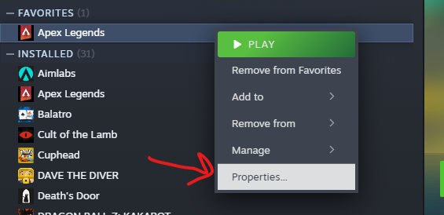
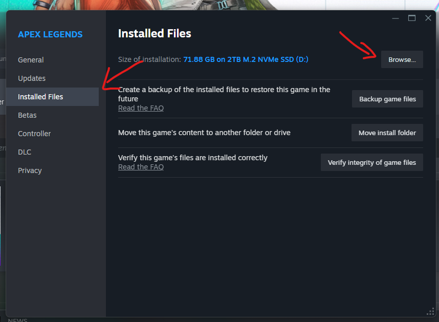
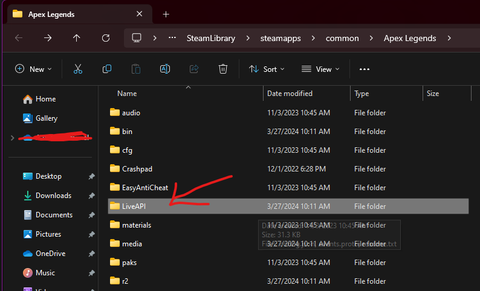
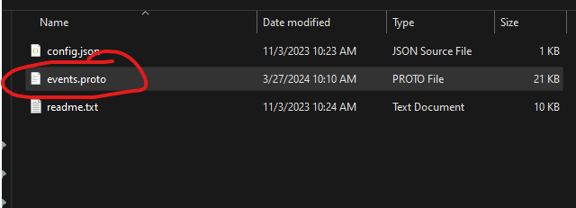

# Apex Events TS
This project is meant to be a quick shell project that allows us to version the TypeScript events that are used in the Hot Metal client.

## Prerequisites

Node 20
- Run `npm install`

## Creating the Events File
Within this project is the `events.proto` file, which is the Apex Legends game events. Running the following command on Windows will create an `events.ts` file using the [`ts-proto`](https://github.com/stephenh/ts-proto) package:
```
protoc --plugin=./node_modules/.bin/protoc-gen-ts_proto.cmd --ts_proto_out=. ./events.proto
```

Alternatively this can be run using `npm run start`

## Obtaining the Proto File

### Steam

To obtain the protobuf file on Steam navigate to Apex in your `Steam Library` and open the context menu. Select `Properties`. 



Then select `Installed Files`, `Browse`.



This will open the Apex Legends file system, in which you will be interested in the `LiveAPI` folder.



Which contains the `events.proto` file. Copy that file into this project and run the command to create events in [Creating the Events File](#creating-the-events-file)

